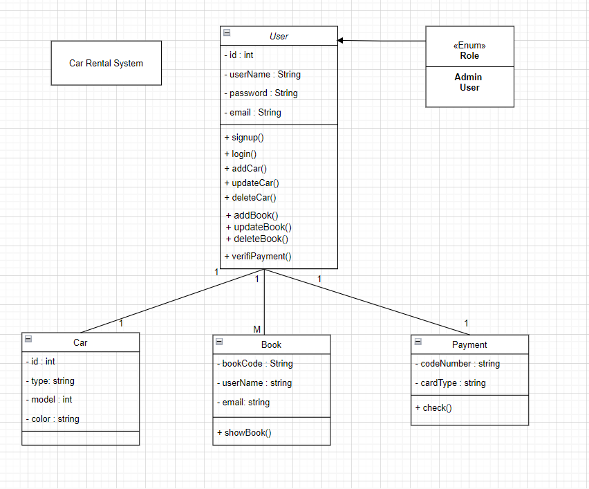

# Car Rental System

## Description of the Project

The Car Rental System is a web-based application designed to streamline the process of renting and managing vehicles. This system allows users to browse available cars, make reservations, and manage their rental history. It is developed with a user-friendly interface to enhance the overall rental experience for both customers and administrators.

## Class Diagram


## FrontEnd link
Frontend = https://github.com/WaleedAlqahtani0/FinalProject-FrontEnd.git

## Setup
1- Clone the repository to your local machine.

2- Install the necessary dependencies.

3- Set up your MySQL database and update the application.properties file with your database credentials:

 ```
   spring.datasource.url=jdbc:mysql://localhost:3306/finalProject
    spring.datasource.username=***
    spring.datasource.password=***
    spring.datasource.driver-class-name=com.mysql.cj.jdbc.Driver

    spring.jpa.hibernate.ddl-auto=update

    spring.jpa.show-sql=true

    server.error.include-stacktrace=never

   ```

4- Run the application

## Technologies Used
- IntelliJ IDEA: As the integrated development environment (IDE).
- Spring Web: For creating the web application.
- MySQL Workbench: For managing the database.
- Postman: For testing the API endpoints.

  
## Controllers and Routes structure
### User

- `GET /users`: Retrieve a list of all users.
- `POST /users/add`: Add new user.
- `DELETE /users/delete/{id}`: Delete a user by their name. 
- `PUT /users/update/{id}`: Update a user's details. The request body should include the updated user details in JSON format.
### Car

- `GET /carRental/cars`: Retrieve a list of all cars.
- `GET /carRental/cars/{id}`: Retrieve a list of car id
- `POST /cars/add`: Add new car.
- `DELETE /carRental/delete/{id}}`: Delete the car by its id.
- `PUT /cars/update/{id}`: Update the car details. The request body should include the updated admins details in JSON format.
  
### Book

- `GET /Student`: Retrieve a list of all book.
- `POST /Student/add`: Add a new book. 
- `DELETE /Student/delete/{id}`: Delete a book by its id. 
- `PUT /Student/update/{id}`: Update a book details. The request body should include the updated Student details in JSON format.
- 
### Payment

- `GET /payment`: Retrieve a list of all Payment.
- `POST /payment/add`: Add a new payment. 
- `DELETE /payment/delete/{id}`: Delete a payment by its ID.
- `PUT /payment/update/{id}`: Update a pament details. The request body should include the updated teacher details in JSON format.


## Extra links(Trello, Presentation Slides)
- [Trello_link](https://trello.com/b/LD6AUfY7/final-project-list)
- [Presentation_slides](https://slides.com/waleed3328/car-rental-system)

## Future Work
In the future, I want to do:  
- improve it to add more features 
  

## Resources
- [Ironhack](https://my.ironhack.com/)
- [Baeldung Jackson Annotations Guide](https://www.baeldung.com/jackson-annotations)
- [Query Methods](https://docs.spring.io/spring-data/jpa/docs/current/reference/html/#jpa.query-methods)
- [Stack OverFlow](https://stackoverflow.com/questions/38403740/authenticate-only-selected-rest-end-points-spring-boot)
